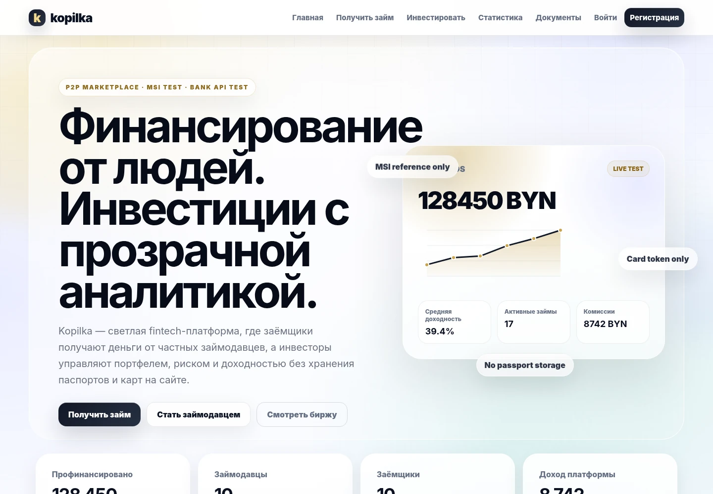
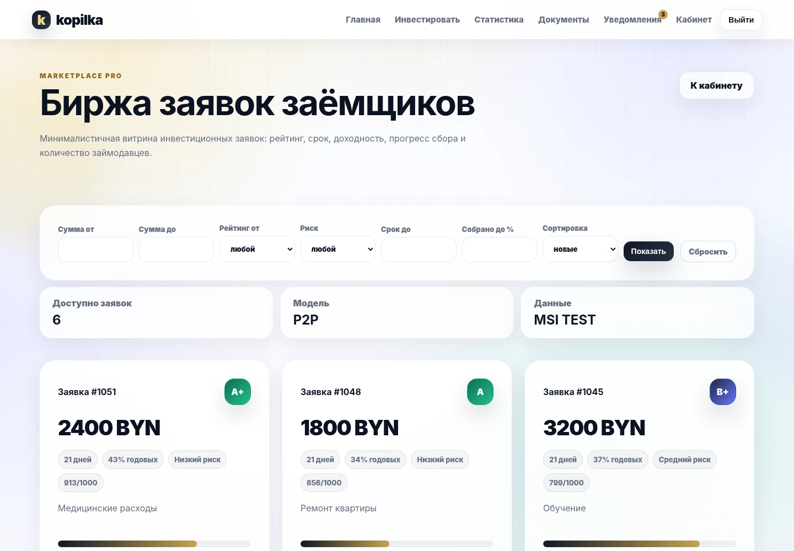
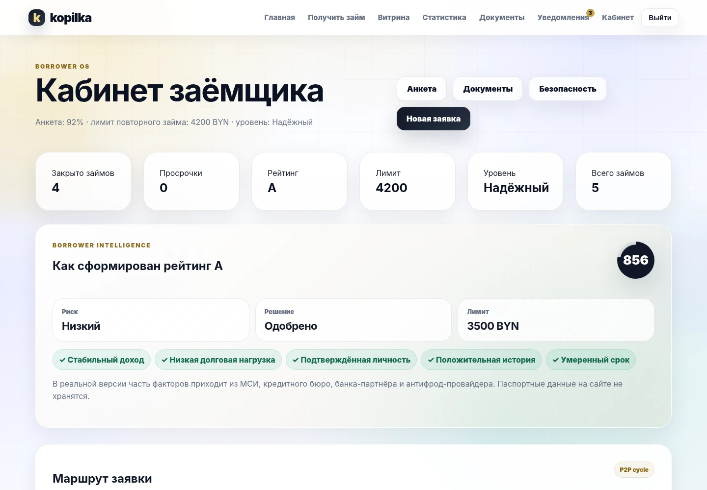
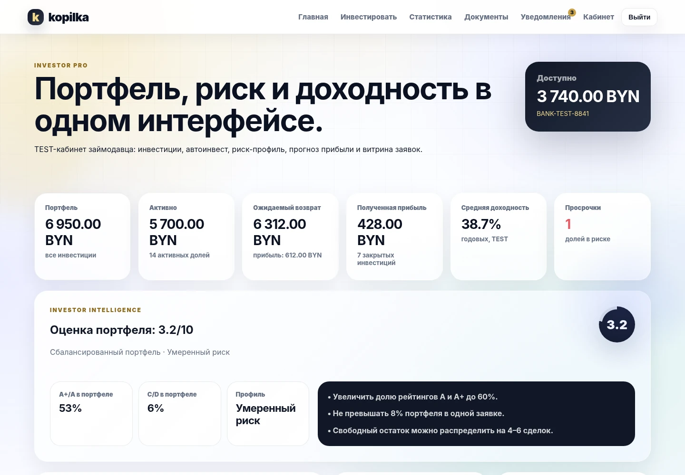
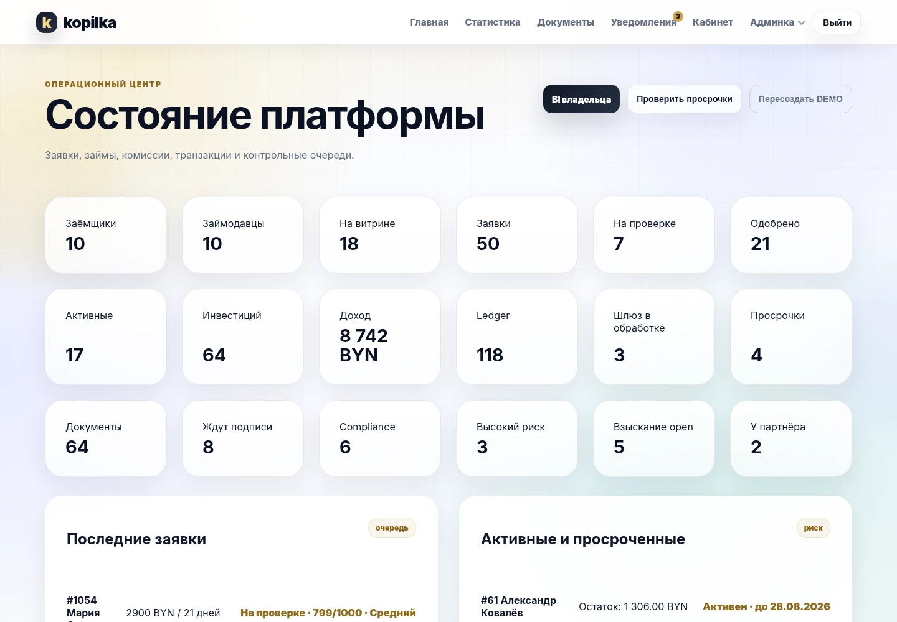
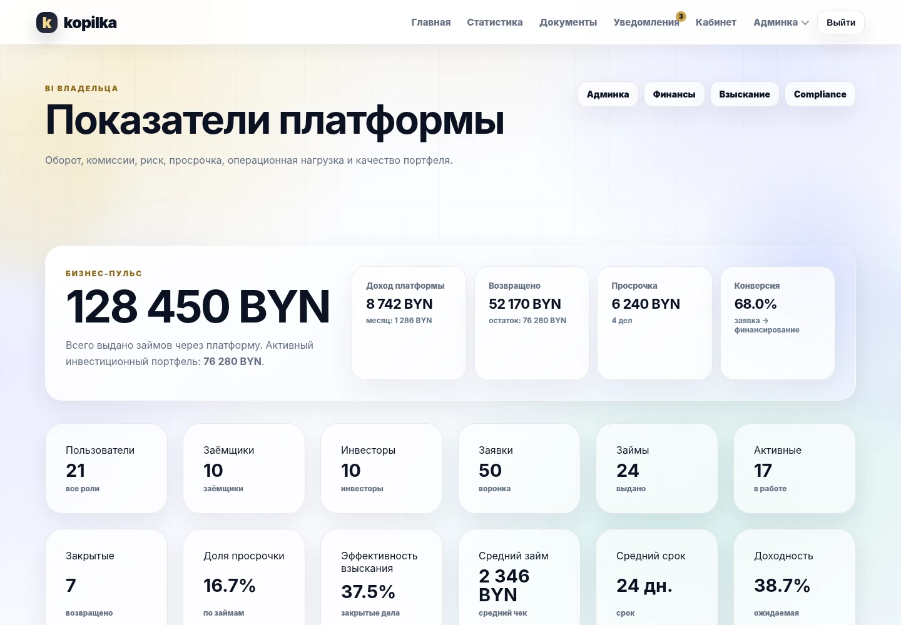
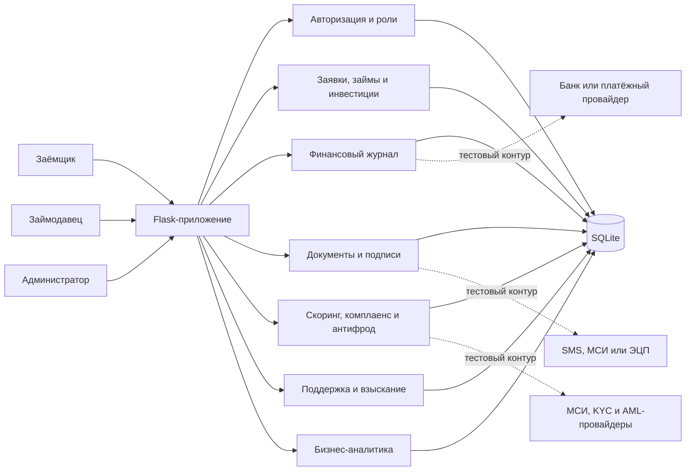

# Kopilka

Демонстрационная P2P-платформа краткосрочных займов на Flask. Заёмщики создают заявки, займодавцы финансируют их полностью или частично, а административный контур ведёт скоринг, финансовые операции, документы, комплаенс, обращения и просрочки.

Проект сделан как функциональный прототип финансового сервиса для портфолио. Реальные платежи, идентификация и юридически значимое подписание в нём не выполняются: внешние интеграции заменены прозрачными тестовыми контурами.

<p align="center">
  
</p>

## Основные возможности

### Заёмщик

- регистрация и личный кабинет;
- анкета без хранения паспортных сканов и полного номера карты;
- имитация проверки через МСИ/KYC-провайдера;
- автоматический скоринг заявки;
- публикация заявки на P2P-витрине;
- просмотр финансирования, договора и графика платежей;
- погашение, продление и история операций;
- уведомления и обращения в поддержку.

### Займодавец

- тестовый кошелёк и журнал его движений;
- витрина заявок с фильтрами и сортировкой;
- частичное или полное финансирование;
- портфель инвестиций и расчёт ожидаемого возврата;
- комиссии платформы;
- автоинвестирование по рейтингу, риску, сроку и доходности;
- документы по каждой профинансированной сделке.

### Администратор

- управление заявками и ручная проверка;
- отдельная тестовая ручная выдача для отладки;
- финансовый журнал, платёжный шлюз и сверка операций;
- юридические документы и журнал подписей;
- AML/KYC, комплаенс и антифрод-проверки;
- операционный центр и поддержка пользователей;
- контроль просрочек и работа с взысканием;
- бизнес-аналитика с ключевыми показателями платформы.

## Интерфейс

Скриншоты собраны на демонстрационных данных и показывают основные роли платформы.

| Биржа заявок | Кабинет заёмщика |
|---|---|
|  |  |
| **Кабинет займодавца** | **Административная панель** |
|  |  |
| **BI владельца** | |
|  | |

## Надёжность демонстрационных сценариев

- CSRF-защита подключена ко всем изменяющим запросам;
- выход из аккаунта выполняется только POST-запросом;
- инвестиционная комиссия учитывается до списания средств;
- кошелёк займодавца не может уйти в минус;
- полное финансирование атомарно создаёт займ, документы, платёжную операцию и бухгалтерские записи;
- нельзя отклонить или вернуть на проверку уже профинансированную заявку;
- переплата сверх остатка займа блокируется;
- повторная подпись одной стороной не создаёт дубликаты событий;
- повторная проверка одной просрочки не ухудшает кредитную историю несколько раз;
- антифрод-блокировка немедленно завершает активную сессию пользователя;
- настройки уведомлений действительно управляют тестовой внешней доставкой;
- повторный запуск взыскания не создаёт одинаковые действия в один день;
- пересборка финансового журнала сохраняет статусы операций и не дублирует комиссии;
- полный DEMO-сброс очищает старый пользовательский контур и пересоздаёт служебные модули;
- основные денежные и административные сценарии покрыты 18 регрессионными тестами.

## Стек

| Слой | Технологии |
|---|---|
| Backend | Python, Flask, Flask-Login, Flask-WTF |
| Данные | Flask-SQLAlchemy, SQLite |
| Интерфейс | Jinja2, HTML, CSS, JavaScript, Chart.js |
| Тесты | `unittest`, Flask test client |
| Локальный запуск | PowerShell, Python `venv` |

Текущая версия проверена на Windows с Python 3.12.10: установка, создание DEMO-базы, запуск приложения и 18 регрессионных тестов проходят успешно.

## Архитектура



## Запуск на Windows

Поддерживается Python 3.11–3.13.

```powershell
Set-ExecutionPolicy -Scope Process Bypass
.\setup.ps1
.\start.ps1
```

После запуска сайт будет доступен по адресу:

```text
http://127.0.0.1:5000
```

`setup.ps1` создаёт `.venv`, устанавливает зависимости и формирует новую базу с демонстрационными данными.

Скрипт автоматически проверяет Python 3.13, 3.12 и 3.11 через `py.exe`, а затем пробует обычные команды `python.exe` и `python3.exe`. Отсутствие одной из версий не прерывает поиск остальных.

Версии библиотек закреплены в `requirements.txt`. Пины безопасности обновлены 6 августа 2026 года; для Flask и Werkzeug используются релизы с исправлениями известных уязвимостей старых версий.

### Ручной запуск

```powershell
py -3.12 -m venv .venv
.\.venv\Scripts\Activate.ps1
python -m pip install -r requirements.txt
python -m flask --app run.py reset-db
python run.py
```

Можно использовать Python 3.11, 3.12 или 3.13, заменив версию в первой команде.

## Демонстрационные аккаунты

| Роль | Логин | Пароль |
|---|---|---|
| Администратор | `admin@kopilka.test` | `admin12345` |
| Заёмщик | `borrower1@kopilka.test` | `demo12345` |
| Займодавец | `investor1@kopilka.test` | `demo12345` |

После сброса базы создаются десять заёмщиков, десять займодавцев и пятьдесят заявок в разных состояниях. Полный список находится в [DEMO_ACCOUNTS.md](DEMO_ACCOUNTS.md).

## Что проверить после запуска

1. Войти как заёмщик и открыть заявку, займ, уведомления и документы.
2. Войти как займодавец, пополнить тестовый кошелёк и профинансировать заявку.
3. Проверить автоинвестирование и состояние инвестиционного портфеля.
4. Войти как администратор и открыть финансовый, юридический, операционный и аналитический разделы.
5. Полностью профинансировать новую заявку и убедиться, что появился займ и пакет документов.

## Полезные команды

Пересоздать демонстрационную базу:

```powershell
.\reset-demo.ps1
```

Запустить регрессионные тесты:

```powershell
.\test.ps1
```

Альтернативно:

```powershell
python -m unittest discover -s tests -v
```

## Настройка окружения

Локальный запуск работает без дополнительных переменных. Для изменения настроек скопируйте `.env.example` в `.env` и задайте нужные значения:

```text
SECRET_KEY=случайный-секретный-ключ
DATABASE_URL=sqlite:///kopilka.sqlite3
FLASK_DEBUG=0
COOKIE_SECURE=0
ALLOW_DEMO_RESET=1
```

PowerShell-скрипты автоматически загружают значения из `.env`.

`ALLOW_DEMO_RESET=0` отключает кнопку полной пересборки DEMO-контура в административной панели. Сброс удаляет всех неадминистративных пользователей и связанные операционные данные, поэтому на публичном стенде эту возможность лучше отключить.

## Структура проекта

```text
kopilka_mvp/
├── app/
│   ├── admin/          # административный контур
│   ├── auth/           # регистрация и авторизация
│   ├── loans/          # кабинеты, заявки, инвестиции и займы
│   ├── main/           # публичные страницы
│   ├── templates/      # Jinja-шаблоны
│   ├── static/         # стили и JavaScript
│   ├── models.py       # модели данных
│   ├── finance.py      # проводки и платёжные операции
│   ├── legal.py        # документы и подписи
│   ├── compliance.py   # AML/KYC и комплаенс
│   ├── antifraud.py    # антифрод-сценарии
│   ├── operations.py   # поддержка и ручные проверки
│   └── collections.py  # просрочки и взыскание
├── docs/
│   └── screenshots/    # скриншоты основных экранов
├── tests/              # регрессионные тесты
├── config.py           # конфигурация приложения
├── run.py              # точка входа и CLI-команды
├── setup.ps1           # первичная подготовка
├── start.ps1           # запуск приложения
├── reset-demo.ps1      # пересоздание базы
└── test.ps1            # запуск тестов
```

## Ограничения прототипа

Проект нельзя использовать для реальных займов без отдельной юридической и технической доработки. Для промышленной эксплуатации потребуются:

- PostgreSQL и миграции схемы базы;
- реальный банк-партнёр или платёжный провайдер;
- официальные МСИ/KYC/AML-интеграции;
- юридически значимая электронная подпись;
- идемпотентные webhook-обработчики и фоновая очередь задач;
- шифрование чувствительных данных и централизованное хранение секретов;
- разграничение административных полномочий;
- журналирование, мониторинг, резервное копирование и план восстановления;
- нагрузочные, интеграционные и независимые проверки безопасности.
